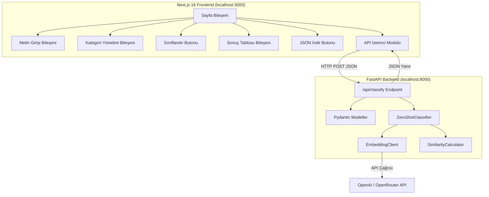

# Tasarım Dokümanı: Next.js Sınıflandırma Frontend ve FastAPI Backend

## Genel Bakış

Bu sistem, mevcut Python tabanlı Zero-Shot metin sınıflandırma motorunu bir FastAPI REST API olarak sunar ve bu API'yi tüketen bir Next.js 16 (App Router) frontend uygulaması sağlar. Kullanıcılar web arayüzü üzerinden metin listesi girip, özel kategoriler tanımlayıp, sınıflandırma çalıştırıp sonuçları tablo formatında görüntüleyebilir ve JSON olarak dışa aktarabilir.

### Temel Tasarım Kararları

- **FastAPI**: Otomatik OpenAPI/Swagger dokümantasyonu, Pydantic model doğrulama ve async desteği nedeniyle tercih edildi
- **Next.js 16 App Router**: Server Components, modern React patterns ve yerleşik routing desteği
- **Ayrı portlar**: Backend `localhost:8000`, Frontend `localhost:3000` — CORS ile bağlantı

## Mimari



### Katmanlar

1. **Frontend Katmanı**: Next.js 16 App Router ile tek sayfalık uygulama. Client Components kullanarak kullanıcı etkileşimlerini yönetir.
2. **API İstemci Katmanı**: Frontend'den backend'e HTTP isteklerini yöneten `fetch` tabanlı modül.
3. **Backend API Katmanı**: FastAPI ile REST endpoint'leri. Pydantic ile istek/yanıt doğrulama.
4. **Sınıflandırma Katmanı**: Mevcut `ZeroShotClassifier`, `EmbeddingClient`, `SimilarityCalculator` bileşenleri.

## Bileşenler ve Arayüzler

### Backend Bileşenleri

#### 1. FastAPI Uygulama (`api/main.py`)

```python
from fastapi import FastAPI
from fastapi.middleware.cors import CORSMiddleware

app = FastAPI(title="Zero-Shot Sınıflandırma API")

app.add_middleware(
    CORSMiddleware,
    allow_origins=["http://localhost:3000"],
    allow_methods=["POST"],
    allow_headers=["*"],
)
```

#### 2. Pydantic İstek/Yanıt Modelleri (`api/schemas.py`)

```python
from pydantic import BaseModel, field_validator

class ClassifyRequest(BaseModel):
    texts: list[str]
    categories: list[str]

    @field_validator("texts")
    @classmethod
    def texts_not_empty(cls, v):
        if not v:
            raise ValueError("Metin listesi boş olamaz")
        return v

    @field_validator("categories")
    @classmethod
    def categories_not_empty(cls, v):
        if not v:
            raise ValueError("Kategori listesi boş olamaz")
        return v

class ClassificationResultItem(BaseModel):
    text: str
    category: str
    similarity_score: float

class ClassifyResponse(BaseModel):
    results: list[ClassificationResultItem]
```

#### 3. Classify Endpoint (`api/main.py`)

```python
@app.post("/api/classify", response_model=ClassifyResponse)
async def classify(request: ClassifyRequest):
    classifier = ZeroShotClassifier(embedding_client)
    for category in request.categories:
        classifier.add_category(category)
    results = classifier.classify_batch(request.texts)
    return ClassifyResponse(
        results=[
            ClassificationResultItem(
                text=r.text,
                category=r.category,
                similarity_score=round(r.similarity_score, 4)
            )
            for r in results
        ]
    )
```

### Frontend Bileşenleri

#### 4. API İstemci Modülü (`frontend/src/lib/api.ts`)

```typescript
export interface ClassifyRequest {
  texts: string[];
  categories: string[];
}

export interface ClassificationResult {
  text: string;
  category: string;
  similarity_score: number;
}

export interface ClassifyResponse {
  results: ClassificationResult[];
}

const API_BASE_URL = process.env.NEXT_PUBLIC_API_URL || "http://localhost:8000";

export async function classify(request: ClassifyRequest): Promise<ClassifyResponse> {
  const response = await fetch(`${API_BASE_URL}/api/classify`, {
    method: "POST",
    headers: { "Content-Type": "application/json" },
    body: JSON.stringify(request),
  });
  if (!response.ok) {
    const error = await response.json();
    throw new Error(error.detail || "Sınıflandırma başarısız oldu");
  }
  return response.json();
}
```

#### 5. Metin Girişi Bileşeni (`frontend/src/components/TextInput.tsx`)

```typescript
interface TextInputProps {
  texts: string[];
  onTextsChange: (texts: string[]) => void;
}

// Textarea bileşeni. Her satır ayrı bir metin olarak ayrıştırılır.
// Boş satırlar filtrelenir. Girilen metin sayısı gösterilir.
```

#### 6. Kategori Yönetimi Bileşeni (`frontend/src/components/CategoryManager.tsx`)

```typescript
interface CategoryManagerProps {
  categories: string[];
  onCategoriesChange: (categories: string[]) => void;
}

// Kategori ekleme input + buton, silme butonu ile liste.
// Boş kategori eklenmesini engeller.
// Varsayılan kategoriler: "Lojistik ve Kargo", "Ürün Kalitesi ve Performans", "Müşteri Hizmetleri ve Destek"
```

#### 7. Sonuç Tablosu Bileşeni (`frontend/src/components/ResultsTable.tsx`)

```typescript
interface ResultsTableProps {
  results: ClassificationResult[];
}

// Metin | Kategori | Benzerlik Skoru sütunları.
// Skor virgülden sonra 4 basamak hassasiyetle gösterilir.
// Toplam sınıflandırılan metin sayısı gösterilir.
```

#### 8. Ana Sayfa (`frontend/src/app/page.tsx`)

```typescript
// Client Component ("use client")
// State: texts, categories, results, loading, error
// TextInput, CategoryManager, Sınıflandır butonu, ResultsTable, JSON İndir butonu
// Sınıflandır butonu: texts veya categories boşsa disabled
// Loading state: spinner gösterilir
// Hata state: hata mesajı gösterilir
```

## Veri Modelleri

### API İstek Modeli (ClassifyRequest)

| Alan         | Tip            | Doğrulama                  | Açıklama                        |
|--------------|----------------|----------------------------|----------------------------------|
| `texts`      | `list[str]`    | Boş liste olamaz           | Sınıflandırılacak metin listesi  |
| `categories` | `list[str]`    | Boş liste olamaz           | Kategori adları listesi          |

### API Yanıt Modeli (ClassifyResponse)

| Alan      | Tip                            | Açıklama                    |
|-----------|--------------------------------|-----------------------------|
| `results` | `list[ClassificationResultItem]` | Sınıflandırma sonuçları   |

### Sonuç Öğesi (ClassificationResultItem)

| Alan               | Tip     | Açıklama                                     |
|--------------------|---------|-----------------------------------------------|
| `text`             | `str`   | Sınıflandırılan orijinal metin                |
| `category`         | `str`   | Atanan kategori adı                            |
| `similarity_score` | `float` | Kosinüs Benzerliği skoru (4 basamak hassasiyet)|

### Frontend State Modeli

| State       | Tip                        | Varsayılan                                                                                     |
|-------------|----------------------------|------------------------------------------------------------------------------------------------|
| `texts`     | `string[]`                 | `[]`                                                                                           |
| `categories`| `string[]`                 | `["Lojistik ve Kargo", "Ürün Kalitesi ve Performans", "Müşteri Hizmetleri ve Destek"]`         |
| `results`   | `ClassificationResult[]`   | `[]`                                                                                           |
| `loading`   | `boolean`                  | `false`                                                                                        |
| `error`     | `string \| null`           | `null`                                                                                         |


## Doğruluk Özellikleri (Correctness Properties)

*Bir özellik (property), bir sistemin tüm geçerli yürütmelerinde doğru olması gereken bir davranış veya karakteristiktir. Özellikler, insan tarafından okunabilir spesifikasyonlar ile makine tarafından doğrulanabilir doğruluk garantileri arasında köprü görevi görür.*

### Property 1: İstek seri hale getirme gidiş-dönüş (round-trip)

*For any* geçerli `ClassifyRequest` nesnesi (boş olmayan metin listesi ve boş olmayan kategori listesi), nesneyi JSON'a seri hale getirip tekrar ayrıştırmak orijinal nesneye eşdeğer bir nesne üretmelidir.

**Validates: Requirements 2.3**

### Property 2: Yanıt yapısı tamlığı

*For any* geçerli sınıflandırma isteği (N adet metin ve M adet kategori içeren), API yanıtı tam olarak N adet sonuç içermeli ve her sonuçta `text`, `category` ve `similarity_score` alanları bulunmalı; `category` alanı gönderilen kategorilerden biri olmalıdır.

**Validates: Requirements 1.3, 2.2**

### Property 3: API skor hassasiyeti

*For any* float değeri, API yanıtındaki `similarity_score` alanı virgülden sonra tam olarak dört basamak hassasiyetle yuvarlanmış olmalıdır.

**Validates: Requirements 2.4**

### Property 4: Metin ayrıştırma — satır bölme ve filtreleme

*For any* çok satırlı metin girişi, textarea'dan ayrıştırma işlemi her satırı ayrı bir metin olarak ayırmalı ve boş veya yalnızca boşluk karakteri içeren satırları filtrelemelidir. Sonuç listesindeki her öğe boş olmayan bir string olmalıdır.

**Validates: Requirements 4.2, 4.3**

### Property 5: Kategori ekleme geçerliliği ve liste büyümesi

*For any* kategori listesi ve boş olmayan kategori adı, kategoriyi eklemek listenin uzunluğunu bir artırmalıdır. *For any* boş veya yalnızca boşluk karakteri içeren kategori adı, ekleme işlemi reddedilmeli ve liste değişmemelidir.

**Validates: Requirements 5.2, 5.4**

### Property 6: Kategori silme ve liste küçülmesi

*For any* kategori listesi ve listede bulunan bir kategori, o kategoriyi silmek listenin uzunluğunu bir azaltmalı ve silinen kategori artık listede bulunmamalıdır.

**Validates: Requirements 5.3**

### Property 7: Sınıflandır butonu devre dışı durumu

*For any* uygulama durumu, metin listesi veya kategori listesi boşsa "Sınıflandır" butonu devre dışı olmalıdır. Her iki liste de en az bir öğe içeriyorsa buton etkin olmalıdır.

**Validates: Requirements 6.4**

### Property 8: Frontend skor gösterim hassasiyeti

*For any* float değeri, frontend'deki skor gösterim fonksiyonu her zaman virgülden sonra tam olarak dört basamak içeren bir string üretmelidir.

**Validates: Requirements 7.2**

### Property 9: JSON dışa aktarma format tutarlılığı

*For any* sınıflandırma sonuç listesi, JSON olarak dışa aktarılan veri API yanıt formatıyla (`{"results": [...]}`) uyumlu olmalı ve her sonuç öğesi `text`, `category`, `similarity_score` alanlarını içermelidir.

**Validates: Requirements 8.3**

## Hata Yönetimi

| Hata Durumu                              | Bileşen        | Davranış                                                              |
|------------------------------------------|----------------|-----------------------------------------------------------------------|
| Boş metin listesi ile istek              | API_Sunucusu   | HTTP 422 döndürür, Pydantic doğrulama hatası mesajı içerir            |
| Boş kategori listesi ile istek           | API_Sunucusu   | HTTP 422 döndürür, Pydantic doğrulama hatası mesajı içerir            |
| Sınıflandırma sırasında hata            | API_Sunucusu   | HTTP 500 döndürür, hata detayını `detail` alanında içerir             |
| Geçersiz JSON istek gövdesi              | API_Sunucusu   | HTTP 422 döndürür, ayrıştırma hatası mesajı içerir                    |
| API çağrısı başarısız (network hatası)   | Frontend       | Kullanıcıya hata mesajı gösterir, `error` state'ini günceller         |
| API çağrısı başarısız (HTTP hata kodu)   | Frontend       | API'den gelen hata mesajını kullanıcıya gösterir                      |
| Boş kategori adı ekleme girişimi         | Frontend       | Eklemeyi engeller, giriş alanı değişmez                               |

## Test Stratejisi

### Kullanılacak Kütüphaneler

**Backend (Python)**:
- **pytest**: Test çerçevesi
- **hypothesis**: Property-based testing kütüphanesi
- **httpx**: FastAPI TestClient için async HTTP istemcisi
- **pytest-asyncio**: Async test desteği

**Frontend (TypeScript)**:
- **Vitest**: Test çerçevesi (Next.js ile uyumlu)
- **fast-check**: Property-based testing kütüphanesi (TypeScript/JavaScript için)
- **React Testing Library**: Bileşen testleri için

### Birim Testleri

Birim testleri belirli örnekler, edge case'ler ve hata durumlarını doğrular:

**Backend**:
- Boş metin listesi ile istek gönderildiğinde HTTP 422 dönmesi (Gereksinim 1.4)
- Boş kategori listesi ile istek gönderildiğinde HTTP 422 dönmesi (Gereksinim 1.5)
- Sınıflandırma hatası simülasyonunda HTTP 500 dönmesi (Gereksinim 1.6)
- CORS header'larının yanıtta bulunması (Gereksinim 3.1)
- Geçerli bir istek ile başarılı sınıflandırma yanıtı (Gereksinim 1.1, 1.3)

**Frontend**:
- Textarea bileşeninin render edilmesi (Gereksinim 4.1)
- Varsayılan kategorilerin yüklenmesi (Gereksinim 5.5)
- Yükleniyor göstergesinin görüntülenmesi (Gereksinim 6.3)
- Hata mesajının gösterilmesi (Gereksinim 6.5)
- Sonuç tablosunun doğru sütunlarla render edilmesi (Gereksinim 7.1)
- Toplam metin sayısının gösterilmesi (Gereksinim 7.3)
- JSON İndir butonunun sonuçlar mevcut olduğunda görünmesi (Gereksinim 8.1)

### Property-Based Testler

Her property testi en az 100 iterasyon çalıştırılmalıdır. Her test, tasarım dokümanındaki property numarasına referans vermelidir.

**Backend (hypothesis)**:
- **Feature: nextjs-classification-frontend, Property 1**: İstek seri hale getirme gidiş-dönüş
- **Feature: nextjs-classification-frontend, Property 2**: Yanıt yapısı tamlığı
- **Feature: nextjs-classification-frontend, Property 3**: API skor hassasiyeti

**Frontend (fast-check)**:
- **Feature: nextjs-classification-frontend, Property 4**: Metin ayrıştırma — satır bölme ve filtreleme
- **Feature: nextjs-classification-frontend, Property 5**: Kategori ekleme geçerliliği ve liste büyümesi
- **Feature: nextjs-classification-frontend, Property 6**: Kategori silme ve liste küçülmesi
- **Feature: nextjs-classification-frontend, Property 7**: Sınıflandır butonu devre dışı durumu
- **Feature: nextjs-classification-frontend, Property 8**: Frontend skor gösterim hassasiyeti
- **Feature: nextjs-classification-frontend, Property 9**: JSON dışa aktarma format tutarlılığı

### Test Organizasyonu

```
tests/
├── api/
│   ├── test_api_classify.py          # API endpoint birim + property testleri
│   └── test_api_schemas.py           # Pydantic model property testleri
frontend/
├── src/
│   ├── __tests__/
│   │   ├── TextInput.test.tsx         # Metin girişi birim + property testleri
│   │   ├── CategoryManager.test.tsx   # Kategori yönetimi birim + property testleri
│   │   ├── ResultsTable.test.tsx      # Sonuç tablosu birim testleri
│   │   ├── page.test.tsx              # Ana sayfa birim + property testleri
│   │   └── api.test.ts               # API istemci testleri
│   └── lib/
│       └── __tests__/
│           └── utils.test.ts          # Yardımcı fonksiyon property testleri
```

### Önemli Notlar

- Backend testlerinde OpenAI API çağrıları mock'lanmalıdır
- Frontend testlerinde API çağrıları mock'lanmalıdır (MSW veya fetch mock)
- Property testlerinde `hypothesis` (Python) ve `fast-check` (TypeScript) kütüphaneleri kullanılmalıdır
- Her property testi tek bir `@given` (hypothesis) veya `fc.assert` (fast-check) çağrısı olmalıdır
- Birim testleri ve property testleri birbirini tamamlar; ikisi birlikte kapsamlı kapsama sağlar
