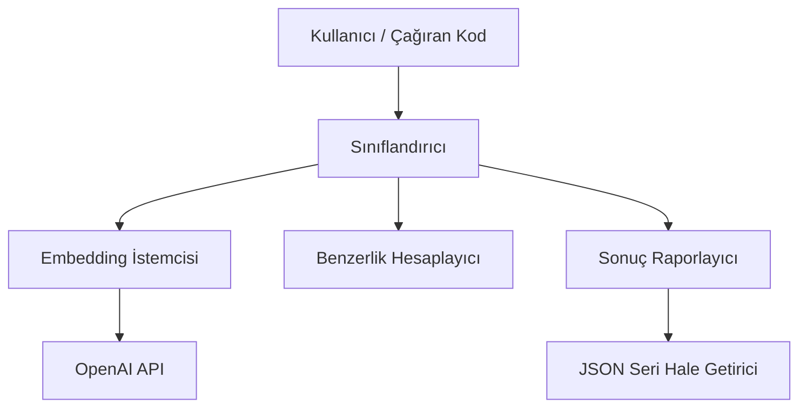

# Tasarım Dokümanı: Zero-Shot Metin Sınıflandırma

## Genel Bakış

Bu sistem, OpenAI'nin `text-embedding-3-small` modeli ve Kosinüs Benzerliği kullanarak müşteri yorumlarını önceden tanımlanmış kategorilere sınıflandırır. Eğitim verisi gerektirmez; tamamen anlamsal embedding vektörleri arasındaki benzerliğe dayanır.

Sistem Python ile geliştirilecek olup `openai`, `scikit-learn` ve `numpy` kütüphanelerini kullanır.

## Mimari

Sistem üç katmanlı bir mimariye sahiptir:



- **Embedding İstemcisi**: OpenAI API ile iletişim kurarak metin embedding vektörlerini alır.
- **Benzerlik Hesaplayıcı**: scikit-learn kullanarak Kosinüs Benzerliği hesaplar.
- **Sınıflandırıcı**: Embedding ve benzerlik bileşenlerini koordine ederek sınıflandırma yapar.
- **Sonuç Raporlayıcı**: Sonuçları yapılandırılmış formatta sunar ve JSON seri hale getirme/ayrıştırma işlemlerini yönetir.

## Bileşenler ve Arayüzler

### 1. EmbeddingClient (Embedding İstemcisi)

```python
class EmbeddingClient:
    def __init__(self, api_key: str | None = None, model: str = "text-embedding-3-small"):
        """OpenAI istemcisini başlatır. api_key verilmezse OPENAI_API_KEY ortam değişkeninden alır."""
        ...

    def get_embedding(self, text: str) -> list[float]:
        """Verilen metin için embedding vektörünü döndürür.
        Boş metin için ValueError, API hatası için RuntimeError fırlatır."""
        ...
```

### 2. SimilarityCalculator (Benzerlik Hesaplayıcı)

```python
class SimilarityCalculator:
    @staticmethod
    def cosine_similarity(vec_a: list[float], vec_b: list[float]) -> float:
        """İki vektör arasındaki Kosinüs Benzerliğini hesaplar.
        scikit-learn cosine_similarity fonksiyonunu kullanır.
        Sonuç -1.0 ile 1.0 arasında bir float değerdir."""
        ...
```

### 3. Category (Kategori Veri Sınıfı)

```python
@dataclass
class Category:
    name: str
    embedding: list[float]
```

### 4. ClassificationResult (Sınıflandırma Sonucu)

```python
@dataclass
class ClassificationResult:
    text: str
    category: str
    similarity_score: float
```

### 5. ZeroShotClassifier (Ana Sınıflandırıcı)

```python
class ZeroShotClassifier:
    def __init__(self, embedding_client: EmbeddingClient):
        """Sınıflandırıcıyı embedding istemcisi ile başlatır."""
        ...

    def add_category(self, category_name: str) -> None:
        """Yeni bir kategori ekler ve embedding vektörünü hesaplar."""
        ...

    def classify(self, text: str) -> ClassificationResult:
        """Tek bir metni sınıflandırır ve sonucu döndürür."""
        ...

    def classify_batch(self, texts: list[str]) -> list[ClassificationResult]:
        """Birden fazla metni sınıflandırır ve sonuçları liste olarak döndürür."""
        ...
```

### 6. ResultReporter (Sonuç Raporlayıcı)

```python
class ResultReporter:
    @staticmethod
    def to_json(results: list[ClassificationResult]) -> str:
        """Sonuçları JSON formatına seri hale getirir."""
        ...

    @staticmethod
    def from_json(json_str: str) -> list[ClassificationResult]:
        """JSON verisini ayrıştırarak ClassificationResult listesine dönüştürür."""
        ...

    @staticmethod
    def format_score(score: float) -> str:
        """Benzerlik skorunu virgülden sonra 4 basamak hassasiyetle formatlar."""
        ...
```

## Veri Modelleri

### Category

| Alan       | Tip            | Açıklama                          |
|------------|----------------|-----------------------------------|
| `name`     | `str`          | Kategori adı                      |
| `embedding`| `list[float]`  | Kategori adının embedding vektörü |

### ClassificationResult

| Alan               | Tip     | Açıklama                                    |
|--------------------|---------|----------------------------------------------|
| `text`             | `str`   | Sınıflandırılan orijinal metin               |
| `category`         | `str`   | Atanan kategori adı                           |
| `similarity_score` | `float` | Kosinüs Benzerliği skoru (-1.0 ile 1.0 arası)|

### Varsayılan Kategoriler

| Kategori Adı                        | Açıklama                                      |
|--------------------------------------|-----------------------------------------------|
| Lojistik ve Kargo                    | Teslimat, kargo, paketleme ile ilgili yorumlar |
| Ürün Kalitesi ve Performans          | Ürün özellikleri, kalite ile ilgili yorumlar    |
| Müşteri Hizmetleri ve Destek         | Müşteri desteği, iletişim ile ilgili yorumlar   |

### JSON Seri Hale Getirme Formatı

```json
[
  {
    "text": "Yorum metni",
    "category": "Kategori adı",
    "similarity_score": 0.8542
  }
]
```


## Doğruluk Özellikleri (Correctness Properties)

*Bir özellik (property), bir sistemin tüm geçerli yürütmelerinde doğru olması gereken bir davranış veya karakteristiktir. Özellikler, insan tarafından okunabilir spesifikasyonlar ile makine tarafından doğrulanabilir doğruluk garantileri arasında köprü görevi görür.*

### Property 1: Kategori ekleme invariantı

*For any* kategori listesi ve yeni kategori adı, yeni kategori eklendiğinde mevcut kategorilerin tümü korunmalı, yeni kategorinin adı ve boş olmayan bir embedding vektörü saklanmalıdır.

**Validates: Requirements 2.2, 2.3**

### Property 2: Kosinüs benzerliği aralık ve öz-benzerlik

*For any* iki rastgele float vektörü (aynı boyutta, sıfır olmayan), Kosinüs Benzerliği sonucu -1.0 ile 1.0 arasında olmalıdır. Ayrıca, *for any* sıfır olmayan vektör, kendisiyle karşılaştırıldığında sonuç 1.0'a yakın (tolerans: 1e-6) olmalıdır.

**Validates: Requirements 3.2, 3.3**

### Property 3: En yüksek skor seçimi

*For any* metin embedding vektörü ve kategori embedding vektörleri kümesi, sınıflandırma sonucunda dönen kategori, tüm kategoriler arasında en yüksek Kosinüs Benzerliği skoruna sahip olan kategori olmalıdır.

**Validates: Requirements 4.2**

### Property 4: Sonuç yapısı bütünlüğü

*For any* sınıflandırma işlemi, dönen ClassificationResult nesnesi boş olmayan bir `text` alanı, geçerli bir `category` alanı (tanımlı kategorilerden biri) ve geçerli bir `similarity_score` alanı (-1.0 ile 1.0 arası float) içermelidir.

**Validates: Requirements 4.3, 5.1**

### Property 5: Toplu sınıflandırma tutarlılığı

*For any* metin listesi, `classify_batch(texts)` sonucu, her metin için `classify(text)` çağrısının sonuçlarıyla aynı olmalı ve girdi sırası korunmalıdır.

**Validates: Requirements 4.5, 5.2**

### Property 6: Skor formatlama hassasiyeti

*For any* float değeri, `format_score` fonksiyonu her zaman virgülden sonra tam olarak 4 basamak içeren bir string döndürmelidir.

**Validates: Requirements 5.3**

### Property 7: JSON seri hale getirme gidiş-dönüş (round-trip)

*For any* geçerli `ClassificationResult` listesi, `from_json(to_json(results))` işlemi orijinal listeye eşdeğer bir liste üretmelidir.

**Validates: Requirements 6.1, 6.2, 6.3**

## Hata Yönetimi

| Hata Durumu                        | Bileşen              | Davranış                                                    |
|------------------------------------|----------------------|-------------------------------------------------------------|
| Boş metin girişi                   | EmbeddingClient      | `ValueError` fırlatır: "Metin boş olamaz"                  |
| API anahtarı eksik                 | EmbeddingClient      | `ValueError` fırlatır: "API anahtarı bulunamadı"            |
| OpenAI API hatası                  | EmbeddingClient      | `RuntimeError` fırlatır, orijinal hata mesajını içerir      |
| Kategori listesi boş               | ZeroShotClassifier   | `ValueError` fırlatır: "En az bir kategori tanımlanmalı"    |
| Farklı boyutta vektörler           | SimilarityCalculator | `ValueError` fırlatır: "Vektör boyutları eşleşmiyor"       |
| Geçersiz JSON verisi               | ResultReporter       | `ValueError` fırlatır, ayrıştırma hata detayını içerir      |

## Test Stratejisi

### Kullanılacak Kütüphaneler

- **pytest**: Test çerçevesi
- **hypothesis**: Property-based testing kütüphanesi (Python için en yaygın PBT kütüphanesi)
- **unittest.mock**: OpenAI API çağrılarını mock'lamak için

### Birim Testleri

Birim testleri belirli örnekler, edge case'ler ve hata durumlarını doğrular:

- Boş metin girişinde `ValueError` fırlatılması (Gereksinim 1.2)
- API hatası simülasyonunda `RuntimeError` fırlatılması (Gereksinim 1.3)
- Varsayılan üç kategorinin doğru yüklenmesi (Gereksinim 2.1)
- Dik vektörlerde benzerlik skorunun ~0.0 olması (Gereksinim 3.4)
- Geçersiz JSON'da `ValueError` fırlatılması (Gereksinim 6.4)

### Property-Based Testler

Her property testi en az 100 iterasyon çalıştırılmalıdır. Her test, tasarım dokümanındaki property numarasına referans vermelidir.

- **Feature: zero-shot-text-classification, Property 1**: Kategori ekleme invariantı
- **Feature: zero-shot-text-classification, Property 2**: Kosinüs benzerliği aralık ve öz-benzerlik
- **Feature: zero-shot-text-classification, Property 3**: En yüksek skor seçimi
- **Feature: zero-shot-text-classification, Property 4**: Sonuç yapısı bütünlüğü
- **Feature: zero-shot-text-classification, Property 5**: Toplu sınıflandırma tutarlılığı
- **Feature: zero-shot-text-classification, Property 6**: Skor formatlama hassasiyeti
- **Feature: zero-shot-text-classification, Property 7**: JSON round-trip

### Test Organizasyonu

```
tests/
├── test_embedding_client.py      # EmbeddingClient birim testleri (mock ile)
├── test_similarity.py            # SimilarityCalculator birim + property testleri
├── test_classifier.py            # ZeroShotClassifier birim + property testleri
├── test_result_reporter.py       # ResultReporter birim + property testleri
└── conftest.py                   # Ortak fixture'lar ve mock'lar
```

### Önemli Notlar

- OpenAI API çağrıları tüm testlerde mock'lanmalıdır (maliyet ve hız nedeniyle)
- Property testlerinde `hypothesis` kütüphanesinin `@given` dekoratörü ve strateji üreteçleri kullanılmalıdır
- Her property testi tek bir `@given` dekoratörlü fonksiyon olmalıdır
- Birim testleri ve property testleri birbirini tamamlar; ikisi birlikte kapsamlı kapsama sağlar
